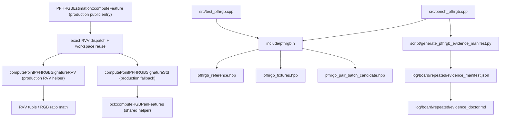

# PFHRGB Test Support Code Map

本文负责测试支撑代码定位和角色边界，不承担性能结论。

## 总调用图

## 稳定入口和内部职责

| 路径 | 职责 | 证据角色 |
| --- | --- | --- |
| `include/pfhrgb.h` | 聚合入口，供 test / bench include。 | test support aggregator（测试支撑聚合入口）。 |
| `include/impl/pfhrgb_fixtures.hpp` | 构造点云、邻域、descriptor 比较和 fixture helper。 | correctness input source。 |
| `include/impl/pfhrgb_reference.hpp` | scalar reference，复刻 production helper 语义。 | correctness oracle。 |
| `include/impl/pfhrgb_pair_batch_candidate.hpp` | RVV candidate、workspace 和 public-shaped wrappers。 | diagnostic / production-shaped diagnostic。 |
| `src/test_pfhrgb.cpp` | gtest executable source。 | correctness aggregate。 |
| `src/bench_pfhrgb.cpp` | bench executable source 和 case-filter registry。 | bench wrapper。 |
| `script/generate_pfhrgb_evidence_manifest.py` | board repeated summary -> manifest。 | evidence summary builder。 |
| `features/include/pcl/features/impl/pfhrgb.hpp` | production Std helper、RVV helper、workspace 和 exact dispatch。 | adopted production path / fallback boundary。 |

## Production 与 Test Support 边界

当前 production 文件 `features/include/pcl/features/impl/pfhrgb.hpp` 已接入 exact-gated RVV path。
`pcl::pfhrgb_rvv_detail::computePointPFHRGBSignatureStd` 保存原标量语义，
`PFHRGBPairBatchWorkspace` 负责跨点复用 staging / tuple buffers，
`computePointPFHRGBSignatureRVV` 在 `__RVV10__` 和 exact 点型 gate 下批量计算 pair tuple 与 RGB ratio。
`computeFeature` 在点循环外创建 workspace，命中 gate 时走 RVV，失败时回到 Std helper。topic-local
`include/impl/pfhrgb_pair_batch_candidate.hpp` 仍保留为 diagnostic / production-shaped diagnostic（诊断 /
生产形态诊断）背景；当前采纳收益来自接入后的 `public_pfhrgb_k` production-public board evidence。
`features/src/pfh.cpp::computeRGBPairFeatures` 是真实 shared helper 语义来源，本 topic 没有修改它。

## Bench Harness 与 Case Registry

`src/bench_pfhrgb.cpp` 持有五个 case label：`component_pfhrgb_signature`、
`candidate_pfhrgb_pair_batch_rvv`、`public_pfhrgb_k`、`public_pfhrgb_k_with_candidate` 和
`public_pfhrgb_k_with_candidate_reuse`。接入后 `public_pfhrgb_k` 是 production-public case；
两个 `*_with_candidate*` label 是 topic-local production-shaped diagnostic 背景。脚本
`generate_pfhrgb_evidence_manifest.py` 为这些 label 补全 evidence role、timer boundary、gate、
checksum policy 和 asm boundary。

## 拆分审计

当前文件布局已采用 `src/`、`include/`、`include/impl/` 和 topic-local `script/`，符合
`.agents/config/defaults.yaml` 的 test support 配置。`pfhrgb_pair_batch_candidate.hpp` 当前约 400 行，包含
candidate、workspace 和 public-shaped wrappers 三类测试支撑职责；仍低于硬拆分阈值。production direct
（真实生产入口直连）逻辑已经转入 `features/include/pcl/features/impl/pfhrgb.hpp`，不再继续把生产分流塞进
topic-local candidate 头文件。若后续新增 point-type expansion、fallback matrix 或多个 implementation
family，应再拆出 candidate / wrapper / workspace 子职责，并同步更新本地图。
