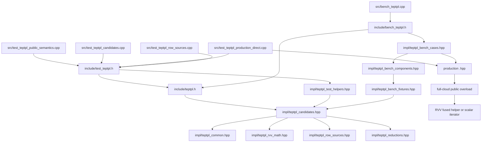

# transformation_estimation_point_to_plane_lls 测试支撑代码地图

## 本文职责

本文解释 `include/teptpl.h`、`include/test_teptpl.h`、`include/bench_teptpl.h`、
`include/impl/teptpl_*.hpp` 和 `src/test_teptpl_*.cpp` 的函数族和调用关系。它只描述
test-rvv 支撑代码，不把 diagnostic helper 写成 production dispatch。

## 总调用图



## 稳定聚合入口

| 文件 | 调用者 | 包含内容 | 规则 |
| --- | --- | --- | --- |
| `include/teptpl.h` | `include/test_teptpl.h`、`include/bench_teptpl.h`。 | common、RVV math、row sources、reductions、candidates。 | test/bench 共用稳定入口；不包含 gtest 或 bench CLI。 |
| `include/test_teptpl.h` | 四个 `src/test_teptpl_*.cpp`。 | `teptpl.h` 与 gtest-only helper。 | 只给 gtest translation units 使用；避免 bench 引入 gtest 依赖。 |
| `include/bench_teptpl.h` | `src/bench_teptpl.cpp`。 | `teptpl.h` 与 bench cases。 | bench 专用入口；保持 `src/bench_teptpl.cpp` 为薄 `main()`。 |

`src` 文件只 include 对应聚合入口，避免直接依赖内部头组合。TEPTPL 只是在 test-rvv 目录里的短 token；production 符号和 topic 名不变。

## 公共类型与标量公式

文件：

```text
include/impl/teptpl_common.hpp
```

| 符号 | 作用 | 调用者 | 证据角色 |
| --- | --- | --- | --- |
| `AccumulationStats` | 记录 input points、accepted points 和是否使用 RVV。 | tests、bench、candidate wrappers。 | gate 命中和 accepted point 证据。 |
| `NormalEquation` | 保存 `ATA`、`ATb` 和 accepted count。 | reference、candidate、assertions。 | 中间态 correctness。 |
| `finite_point_and_normal` | 检查 source xyz、target xyz 和 target normal 是否有限。 | full-cloud / indexed reference。 | finite mask 标量合同。 |
| `accumulate_formula` / row helpers | 按 point-to-plane row 公式累加 normal equation。 | std reference 和 row-source helpers。 | test-only 标量参考链路。 |
| `complete_symmetric_upper` | 补齐 `ATA` 下三角。 | solver helper。 | Eigen solve 输入完整性。 |
| `construct_transformation_matrix` | 从 6 维解构造 4x4 matrix。 | solver helper。 | 输出 matrix 合同。 |
| `solve_normal_equation` | 完成 normal equation、求解并构造 matrix。 | estimate candidate wrappers。 | full estimate correctness。 |
| `accumulate_std_full` | full-cloud test-only 标量 reference。 | production direct tests 和 candidate tests。 | expected normal-equation 主参考；不属于 production runtime。 |

## RVV Math Helper

文件：

```text
include/impl/teptpl_rvv_math.hpp
```

| 符号 / 函数族 | 作用 | 证据角色 |
| --- | --- | --- |
| `finite_mask_f32m1/m2` | 为 RVV lane 生成 finite mask。 | invalid lane correctness。 |
| strided / gathered field load helpers | 按 AoS stride 或 index stream 读取 source / target 字段。 | layout 和 row-source diagnostic。 |
| formula / reduction utilities | 生成 `a/b/c/d`、normal fields 和 partial sums。 | RVV candidate correctness。 |
| `reduce_sum_f32m1` / `reduce_product_sum_f32m1` | 横向规约 vector accumulator。 | normal-equation partial sum。 |

这些 helper 只服务 test-rvv candidate 或 production helper 对拍。它们不是 public API。

## Row Source Policy

文件：

```text
include/impl/teptpl_row_sources.hpp
```

| 类型 / 函数族 | RowSourcePolicy | 证据角色 | 边界 |
| --- | --- | --- | --- |
| `FullCloudRowSource` | `source[k] + target[k]`。 | full-cloud diagnostic input adapter。 | 当前唯一 production candidate row source。 |
| `SourceIndexedRowSource` | `source[indices[k]] + target[k]`。 | source-indexed diagnostic。 | production 仍标量。 |
| `DualIndexedRowSource` | `source[src_indices[k]] + target[tgt_indices[k]]`。 | dual-indices diagnostic。 | production 仍标量。 |
| row-source accumulation templates | 连接 row source 和 reduction candidate。 | candidate family carry-over 的测试支撑。 | defensive diagnostic 不等于 public invalid-index contract。 |

## Reduction Candidate

文件：

```text
include/impl/teptpl_reductions.hpp
```

| 函数族 | 作用 | 当前状态 |
| --- | --- | --- |
| early fused / grouped reductions | 历史 reduction organization。 | attempted / not adopted。 |
| block-reduction helpers | A/B/C/N groups 分块规约。 | current block baseline 和 production family 基础。 |
| block-fused-formula helpers | fused `a/b/c/d` formula + block groups。 | adopted production hot path 的 test-support 对拍形态。 |
| trusted-dense variants | 跳过部分 finite 成本的诊断。 | rejected for current production boundary。 |

## Candidate Estimate Wrapper

文件：

```text
include/impl/teptpl_candidates.hpp
```

| 函数族 | 调用内容 | 用途 |
| --- | --- | --- |
| `accumulate_candidate_full*` | full-cloud reduction candidate。 | full-cloud correctness / bench direct helper。 |
| `estimate_candidate_full*` | full-cloud candidate + solve。 | matrix-level tests and bench rows。 |
| `estimate_candidate_source_indices*` | source-indexed diagnostic candidate。 | historical row-source tests / bench。 |
| `estimate_candidate_dual_indices*` | dual-indices diagnostic candidate。 | historical row-source tests / bench。 |
| `estimate_candidate_correspondences*` | correspondence diagnostic candidate。 | query/match expansion tests / bench。 |
| `matrix_checksum` | matrix output fingerprint。 | bench checksum。 |

## GTest Helper

文件：

```text
include/impl/teptpl_test_helpers.hpp
```

| 函数族 | 作用 | 证据角色 |
| --- | --- | --- |
| deterministic fixture builders | 构造曲面、invalid lane、scale stress、near-cancellation 和 generic point type 样本。 | correctness input corpus。 |
| assertion helpers | 对比 matrix、normal equation、accepted points 和 fallback stats。 | gtest gate（会导致测试失败的验收条件）。 |
| production bridge helpers | 把 production RVV normal-equation 输出转换到 test-support equation 形态。 | production direct 中间态对拍。 |

该文件包含 gtest 依赖，因此只由 `include/test_teptpl.h` 引入。

## Bench Helper

文件：

```text
include/impl/teptpl_bench_fixtures.hpp
include/impl/teptpl_bench_components.hpp
include/impl/teptpl_bench_cases.hpp
```

| 文件 | 职责 | 证据角色 |
| --- | --- | --- |
| `teptpl_bench_fixtures.hpp` | deterministic bench cloud、indices、correspondences 和 CLI 参数解析基础。 | 输入构造和 label contract。 |
| `teptpl_bench_components.hpp` | component-only load/store、formula、mask/compress、tail 和 no-solve helper。 | component ablation 线索。 |
| `teptpl_bench_cases.hpp` | bench case registry、case-filter、计时边界、checksum 和 `run_teptpl_bench`。 | bench harness 与输出合同。 |

## Test Source

| 文件 | 职责 |
| --- | --- |
| `src/test_teptpl_public_semantics.cpp` | 构造 public estimator 与 test-only reference 对拍，证明 full-cloud、source-indexed、dual-indices 和 correspondences 的有效输入语义。 |
| `src/test_teptpl_candidates.cpp` | 覆盖 full-cloud historical candidate、block reduction、fused formula、invalid lane、scale stress 和 near-cancellation。 |
| `src/test_teptpl_production_direct.cpp` | 覆盖真实 production public overload、production RVV normal-equation、generic source/target、layout gate、small input 和 `Scalar=double` fallback。 |
| `src/test_teptpl_row_sources.cpp` | 覆盖 source-indexed、dual-indices、correspondences diagnostic、isolated size gate 和 finite mask helper。 |

四个源文件共用原 gtest suite 名和 case 名；Make target 名仍是
`test_transformation_estimation_point_to_plane_lls_std` 和
`test_transformation_estimation_point_to_plane_lls_rvv`。

## Bench Source

文件：

```text
src/bench_teptpl.cpp
```

职责：

- 保留 `main()` 和异常边界。
- include `bench_teptpl.h` 后调用 `run_teptpl_bench`。
- 不承载 case registry、fixtures 或 component helper；这些职责已经迁到 `include/impl/teptpl_bench_*.hpp`。

bench label、case-filter、checksum 输出和 Make target 名保持不变。

## Production 侧定位

| production 符号 | 作用 | test-rvv 入口 |
| --- | --- | --- |
| full-cloud public overload | 先尝试 RVV gate，失败回标量。 | `ProductionFullCloud*` tests、production-dispatch bench rows。 |
| `estimatePointToPlaneLLSFullCloudRVV` | RVV 尝试层，只覆盖当前 gate。 | fallback / gate tests。 |
| `buildPointToPlaneLLSFullCloudBlockRVVFusedFormula` | production RVV normal-equation helper。 | fused production tests、asm attribution。 |
| `estimateRigidTransformationFullCloudStd` | full-cloud scalar fallback wrapper。 | fallback tests 和 std build。 |

生产源码注释保持克制；测试资产和本文承担 reviewer navigation（审查导航）。

## 后续结构动作

| 动作 | 当前状态 | 恢复条件 |
| --- | --- | --- |
| split test source | adopted in Phase 050 | 已拆为四个 `src/test_teptpl_*.cpp`；新增测试按现有分组落位。 |
| thin bench entry | adopted in Phase 050 | `src/bench_teptpl.cpp` 已是薄入口；新增 bench case 放入 `include/impl/teptpl_bench_cases.hpp`。 |
| move internal helpers to `include/impl` | adopted in Phase 050 | 旧 `test_support/` 不再作为当前 include 路径；不新增 compatibility alias。 |
| add topic-local scripts | deferred with stop condition | 只有新增 repeated board collection、manifest generation 或 Evidence Doctor wrapper 时再做。 |
