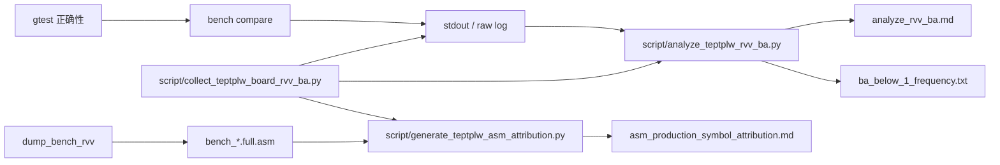

# transformation_estimation_point_to_plane_lls_weighted 总览

这个目录是 `registration/transformation_estimation_point_to_plane_lls_weighted` 的 RVV 专项工作区。
它同时包含：

- 生产实现代码
- gtest 正确性测试
- bench / board 性能测试
- include 聚合入口与 impl 诊断候选
- 统计脚本
- board / qemu 输出证据

如果你在问“这些点型是怎么测出来的”、“日志怎么来的”、“asm 归因怎么做”，先看这份文件。

## 目录分工

| 路径 | 作用 |
| --- | --- |
| `registration/include/pcl/registration/impl/transformation_estimation_point_to_plane_lls_weighted.hpp` | 生产实现和默认 dispatch。 |
| `src/test_teptplw_*.cpp` | gtest 按 public semantics、candidate、row source/fallback 和 production direct 分层。 |
| `src/bench_teptplw.cpp` | bench 薄入口：解析参数、设置 warm-up、打印输出。 |
| `include/impl/teptplw_bench_cases.hpp` | bench case registry：维护 case-filter、case label、计时边界和 trace 分支。 |
| `include/teptplw.h` | test/bench 使用的稳定聚合入口。 |
| `include/test_teptplw.h` / `include/bench_teptplw.h` | gtest-only assertions 与 bench-only harness 的分层聚合入口。 |
| `include/impl/` | fixtures、assertions、bench harness、bench case registry、test-only candidate、layout-gated helper、消融用实现。 |
| `doc/transformation_estimation_point_to_plane_lls_weighted-evaluation.zh.md` | 候选取舍、历史 diagnostic A/B 和接入风险的主归属。 |
| `log/qemu/` | QEMU bench / test compare 日志。 |
| `log/board/` | 板卡 raw log、分析表、汇总摘要、asm 归因。 |
| `Makefile` / `board.mk` | 该 topic 的构建、测试、bench、dump、board 入口。 |

## 数据流



## 点型是怎么来的

bench 和 gtest 先生成一份确定性的 `PointNormal` 曲面点云，再复用同一几何数据构造不同 layout。

三类代表点型如下：

- `PointNormal -> PointNormal`：source / target 都是 `PointNormal`
- `PointXYZ -> PointNormal`：source 通过 `copySourceAsXYZ(...)` 转成 `PointXYZ`
- `PointXYZ -> PointXYZINormal`：target 通过 `copyTargetAsXYZINormal(...)` 转成 `PointXYZINormal`

对应位置在：

- `include/impl/teptplw_bench_cases.hpp`
- `src/test_teptplw_candidates.cpp`
- `src/test_teptplw_production_direct.cpp`

## 主要测试入口

### gtest

gtest 负责 correctness、非有限值语义、layout-gated candidate 对拍、production 默认 fused path 对拍。

重点测试：

- `FullCloudGenericAbcFusedRepresentativePointTypesMatchStd`
- `FullCloudGenericDAndAbcdFusedRepresentativePointTypesMatchStd`
- `ProductionDefaultFusedAbcdIlpRepresentativePointTypesMatchStd`

这三组测试都覆盖上述三类代表点型。

### bench

bench 负责性能、trace、checksum 和 board 统计。

常用 case-filter：

- `production-dispatch`
- `production-shaped-fused-formula`
- `generic-fused-abc`
- `generic-fused-formula`
- `generic-fused-abc-trace`
- `production-default-fused-abcd-ilp`

这些 filter 的边界不同，不能混在同一个结论里：

| case-filter | 调用边界 | 适用结论 |
| --- | --- | --- |
| `production-dispatch` | 真实 public overload，Std 和 RVV 都走同一个公开入口。 | production direct 的 std/RVV 性能证据。 |
| `production-default-fused-abcd-ilp` | 真实 public overload，记录当前默认 production fused 公式 trace。 | 接入后默认路径的 checksum 和运行态稳定性。 |
| `production-shaped-fused-formula` | test_support layout-gated block helper 对 test_support fused helper。 | 同边界 full estimate 公式消融。 |
| `generic-fused-abc` | 三类代表点型的 test_support component no-solve 和 full estimate helper。 | `abc` 与 `abc-ilp` 的代表点型消融。 |
| `generic-fused-formula` | 三类代表点型的 test_support component no-solve 和 full estimate helper。 | `abc`、D 项、`abcd` 及 ILP 变体的代表点型消融。 |
| `generic-fused-abc-trace` | 单个代表点型的 test_support trace。 | 排查运行顺序和 iteration 长尾。 |

`run_case` 用于普通计时；`run_case_trace` 会额外记录每次 iteration 的耗时，并输出 `Iteration Min/Median/Max`，便于排查长尾和异常值。

bench 输出里最重要的字段是：

- `Dataset`
- `Iterations`
- `Warmup Iterations`
- `Build`
- 每个 case 的 `ms/iter`
- `Total Time`
- `Checksum`

checksum 的作用是防止“只看时间但跑飞了”。这里的 checksum 是稳定的日志指纹，和数学误差上限属于两种检查。bench 会把每次迭代得到的结果变成一个浮点校验值，再在日志里打印出来。只要实现、布局、输入和求解路径没有变，这个值就应当稳定；如果时间看起来很好但 checksum 变了，通常说明结果已经不可信。

实现位置：

- 组件型 no-solve checksum：`include/impl/teptplw_bench_harness.hpp` 的 `normal_equation_checksum(...)`
- full-cloud solve checksum：`include/impl/teptplw_common.hpp` 的 `diag::matrix_checksum(...)`

board 采集脚本还会把每个 run 的 checksum 行抽出来做序列比对，确认：

- 每轮日志里都有 checksum 行
- 每轮 checksum 序列一致
- 末尾总 checksum 一致

这一步用于确认结果序列稳定，不参与快慢判断。

## 统计与采集脚本

### 一键 board 采集

脚本：

- `test-rvv/registration/transformation_estimation_point_to_plane_lls_weighted/script/collect_teptplw_board_rvv_ba.py`

它把 production-loop 需要的动作串成一次命令：部署 RVV bench、多轮上板运行、保存每轮 raw log、记录板卡环境、校验 checksum、生成 RVV-vs-RVV B/A 表、统计低于阈值的频率，并按 profile 生成 asm 归因。默认输出目录在：

```text
test-rvv/registration/transformation_estimation_point_to_plane_lls_weighted/log/board/<case>/
```

production-default `abcd-ilp` 采集示例：

```bash
python3 test-rvv/registration/transformation_estimation_point_to_plane_lls_weighted/script/collect_teptplw_board_rvv_ba.py \
  --case-filter production-default-fused-abcd-ilp \
  --size 262144 \
  --runs 5 \
  --iterations 20 \
  --warmup-iterations 5
```

先检查命令形状但不上板运行：

```bash
python3 test-rvv/registration/transformation_estimation_point_to_plane_lls_weighted/script/collect_teptplw_board_rvv_ba.py \
  --dry-run \
  --skip-deploy \
  --skip-asm \
  --runs 1
```

标准产物包括：

- `collection_manifest.json`：采集参数、git 状态和远端 bench 信息。
- `board_env_before.log` / `board_env_after.log`：板卡时间、内核、频率状态和可读的 thermal zone 温度。
- `run01_rvv.log` ... `runNN_rvv.log`：每轮 RVV raw log。
- `checksum_validation.md`：每轮 checksum 序列是否存在且一致。
- `analyze_rvv_ba.md`：同一 RVV log 内的 baseline/candidate B/A 统计；接入后的 `production-default-fused-abcd-ilp` 不再有同二进制内的旧 block/fused pair，因此该表主要用于历史 `production-symbol-*` 或 test_support candidate。
- `ba_below_1_frequency.txt`：低于阈值的 run 频率，用来判断异常是否稳定复现；只对存在 B/A pair 的 case 有意义。
- `trace_summary.md`：逐 case 汇总多轮 avg、p10/p90、iteration median 和最大长尾；对接入后的 production-default trace 有意义。
- `asm_production_symbol_attribution.md` 或 `asm_generic_fused_formula_attribution.md`：符号级 asm 归因。

### RVV-vs-RVV B/A

脚本：

- `test-rvv/registration/transformation_estimation_point_to_plane_lls_weighted/script/analyze_teptplw_rvv_ba.py`

它比较同一份 RVV log 内的候选对比，和 Std/RVV speedup 属于两种口径。接入前的旧 `production-symbol-fused-abcd-ilp` 输出目录仍可用这个脚本分析 block baseline 与 fused helper 的 B/A；接入后默认 production 已经只有 fused path，同一 production 二进制内不再保留旧 block/fused 成对符号。

口径：

```text
B/A = block-baseline_rvv_ms / block-fused-candidate_rvv_ms
```

常用参数：

```text
--case-filter production-symbol
--below-threshold-report <path>
--below-threshold 1.0
```

其中 `--below-threshold-report` 会输出类似 `ba_below_1_frequency.txt` 的频率摘要。

示例：

```bash
python3 test-rvv/registration/transformation_estimation_point_to_plane_lls_weighted/script/analyze_teptplw_rvv_ba.py \
  test-rvv/registration/transformation_estimation_point_to_plane_lls_weighted/log/board/production_symbol_fused_abcd_ilp/run*_rvv.log \
  --case-filter production-symbol \
  --output \
    test-rvv/registration/transformation_estimation_point_to_plane_lls_weighted/log/board/production_symbol_fused_abcd_ilp/analyze_rvv_ba.md \
  --below-threshold-report \
    test-rvv/registration/transformation_estimation_point_to_plane_lls_weighted/log/board/production_symbol_fused_abcd_ilp/ba_below_1_frequency.txt
```

### asm 归因

脚本：

- `test-rvv/registration/transformation_estimation_point_to_plane_lls_weighted/script/generate_teptplw_asm_attribution.py`

它读取 `dump_bench_rvv` 生成的 `.full.asm`，然后按符号统计：

- `rvv total`
- `vset`
- `vlse32`
- `vle32`
- `vfmul`
- `vfadd`
- `vfsub`
- `vfmacc`
- `vfmsac`
- `vmerge`
- `vfred`
- `vcpop`
- `spill/reload`
- `jal`

当前支持三个 profile：

- `production-default-fused-abcd-ilp`：统计当前默认 production RVV 符号；该路径已经采用 fused-abcd-ilp 公式形态。脚本优先使用 `buildPointToPlaneLLSWeightedFullCloudBlockRVV` detail 符号；如果该点型的 detail 符号被编译器内联/合并，则回退到 `estimatePointToPlaneLLSWeightedFullCloudRVV`、public full-cloud overload 或 iterator clone，并在表格 `boundary` 列写明实际归因边界。
- `production-symbol-fused-abcd-ilp`：历史接入前 profile，统计真实 production detail baseline 与 production detail fused helper；接入后默认构建不再产生 fused helper 符号。
- `generic-fused-formula`：统计 test_support generic fused formula mode，并用 production detail baseline 配对；这个 profile 只用于 codegen 归因，不表示 candidate 已接 production。

production-default 示例：

```bash
python3 test-rvv/registration/transformation_estimation_point_to_plane_lls_weighted/script/generate_teptplw_asm_attribution.py \
  --profile production-default-fused-abcd-ilp \
  --asm test-rvv/registration/transformation_estimation_point_to_plane_lls_weighted/build/asm/riscv/bench_transformation_estimation_point_to_plane_lls_weighted_rvv.full.asm \
  --output /tmp/teptplw_production_default_fused_abcd_ilp_asm.md
```

generic 示例：

```bash
python3 test-rvv/registration/transformation_estimation_point_to_plane_lls_weighted/script/generate_teptplw_asm_attribution.py \
  --profile generic-fused-formula \
  --asm test-rvv/registration/transformation_estimation_point_to_plane_lls_weighted/build/asm/riscv/bench_transformation_estimation_point_to_plane_lls_weighted_rvv.full.asm \
  --output /tmp/teptplw_generic_fused_formula_asm.md
```

## 常用命令

```text
make -C test-rvv/registration/transformation_estimation_point_to_plane_lls_weighted run_test_compare
make -C test-rvv/registration/transformation_estimation_point_to_plane_lls_weighted run_bench_compare
make -C test-rvv/registration/transformation_estimation_point_to_plane_lls_weighted dump_bench_rvv
make -C test-rvv/registration/transformation_estimation_point_to_plane_lls_weighted board_smoke
make -C test-rvv/registration/transformation_estimation_point_to_plane_lls_weighted collect_board_production_default_fused_abcd_ilp
make -C test-rvv/registration/transformation_estimation_point_to_plane_lls_weighted clean_board_production_default_fused_abcd_ilp
make -C test-rvv/registration/transformation_estimation_point_to_plane_lls_weighted refresh_board_production_default_fused_abcd_ilp
make -C test-rvv/registration/transformation_estimation_point_to_plane_lls_weighted asm_production_default_fused_abcd_ilp
make -C test-rvv/registration/transformation_estimation_point_to_plane_lls_weighted collect_board_production_dispatch_repeated
make -C test-rvv/registration/transformation_estimation_point_to_plane_lls_weighted refresh_board_production_dispatch_repeated
python3 test-rvv/registration/transformation_estimation_point_to_plane_lls_weighted/script/collect_teptplw_board_rvv_ba.py --dry-run --runs 1
```

`collect_board_production_default_fused_abcd_ilp` 会拒绝写入非空输出目录，防止混合新旧 raw log、checksum、trace 和 asm 证据。`collect_board_production_dispatch_repeated` 只保留 repeated std/RVV speedup summary，重复执行会按当前参数重写 `summary.md`。需要把固定目录清干净后重跑时，使用对应的 `refresh_*` target。

如果你只想看某一轮 board 结果，优先找：

- `log/board/*/run*_rvv.log`
- `log/board/*/analyze_rvv_ba.md`
- `log/board/*/ba_below_1_frequency.txt`
- `log/board/*/asm_production_symbol_attribution.md`

## 代码定位提示

如果你想快速定位逻辑：

- candidate 列表：`include/impl/teptplw_test_helpers.hpp` 的 `weightedFusedFormulaCases()`
- abc 代表点型 correctness：`FullCloudGenericAbcFusedRepresentativePointTypesMatchStd`
- D / abcd 代表点型 correctness：`FullCloudGenericDAndAbcdFusedRepresentativePointTypesMatchStd`
- production default correctness：`ProductionDefaultFusedAbcdIlpRepresentativePointTypesMatchStd`
- 普通计时：`include/impl/teptplw_bench_harness.hpp` 的 `run_case(...)`
- 逐 iteration trace：同文件的 `run_case_trace(...)`
- generic fused bench：`include/impl/teptplw_bench_cases.hpp` 的 `generic-fused-abc` / `generic-fused-formula` 分支
- production default fused bench：同文件的 `production-default-fused-abcd-ilp` 分支
- production fused 公式块：`transformation_estimation_point_to_plane_lls_weighted.hpp` 的 `loadPointToPlaneLLSWeightedFullReductionVectors(...)`
- 默认 production dispatch：同文件的 `buildPointToPlaneLLSWeightedFullCloudDefault(...)`

## 当前证据

这个 topic 里，fused formula 已按人工接入判断切入默认 production full-cloud RVV path。默认路径仍保留 A/B/C/N block-reduction partial sums，但逐点 `a/b/c/d` 公式块采用 `abcd-fused-ilp` 写法。

接入依据是：RVV 相对 std 正向，静态实现质量更高；接入前 20-run 复测中 `PointXYZ -> PointNormal` 与 `PointXYZ -> PointXYZINormal` 平均正向且异常频率未过半，`PointNormal -> PointNormal` 存在 avg B/A median `0.976x`、avg 低于 `1.0x` `12/20` 的争议。该风险按人工判断接受，并在 evaluation 文档中保留数据与原因分析。

当前固定目录证据：

- `log/qemu/run_test_std.log` / `log/qemu/run_test_rvv.log`：`run_test_compare` 的 QEMU correctness logs。std 31 passed + 1 skipped，RVV 32 passed。
- `log/board/production_dispatch_fused_abcd_ilp/summary.md`：当前 production default 的 repeated std/RVV speedup。262144 点、5 runs、20 iterations、5 warm-up。三类代表点型 median/min 分别为 `2.76x / 2.73x`、`2.98x / 2.95x`、`3.00x / 2.96x`。
- `log/board/production_default_fused_abcd_ilp/trace_summary.md`：当前默认 RVV path 的 5-run trace。三类代表点型 checksum 序列一致。
- `log/board/production_default_fused_abcd_ilp/asm_production_symbol_attribution.md`：当前默认 production helper 的符号级 asm 归因。
