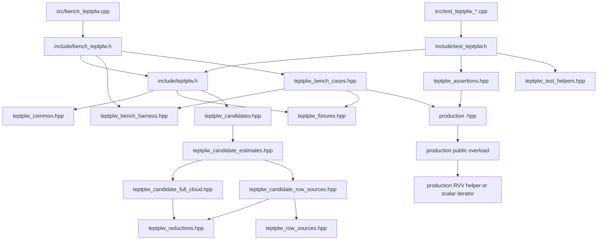

# transformation_estimation_point_to_plane_lls_weighted 测试支撑代码地图

## 本文职责

本文解释 `include/impl` 和 `src` 的函数族。读者可以不先阅读 C++ 代码。本文说明每个文件负责什么、由谁调用、调用后产生哪类证据，以及哪些 helper 只服务 test-rvv。

## 总调用图



## 稳定聚合入口

| 文件 | 调用者 | 包含内容 | 规则 |
| --- | --- | --- | --- |
| `include/teptplw.h` | test 和 bench 共用。 | candidates 与 fixtures 的宽口径入口。 | 不包含 gtest，也不包含 bench CLI。 |
| `include/test_teptplw.h` | `src/test_teptplw_*.cpp`。 | `teptplw.h`、assertions、test helper。 | 只给 gtest 使用。 |
| `include/bench_teptplw.h` | `src/bench_teptplw.cpp`。 | `teptplw.h`、bench harness、bench cases。 | 不引入 gtest。 |

聚合入口保持稳定。`src` 文件只 include 聚合入口，避免直接依赖内部头组合。

## 公共类型与标量公式

文件：

```text
include/impl/teptplw_common.hpp
```

主要实体：

| 符号 | 作用 | 被调用者 | 证据角色 |
| --- | --- | --- | --- |
| `AccumulationStats` | 记录输入点数、accepted 点数和是否使用 RVV。 | candidate、tests、bench。 | 证明 gate 命中和 accepted point 一致。 |
| `NormalEquation` | 保存 6x6 `ATA`、6x1 `ATb` 和 accepted point 数。 | row source、reduction、assertions。 | 中间态 correctness。 |
| `finite_point_and_normal` | 检查 source xyz、target xyz、target normal 是否有限。 | std reference、candidate。 | finite mask 标量合同。 |
| `accumulate_weighted_row` | 加权行公式。先 `normal *= weight`，再生成 `a/b/c/d` 并累加 `ATA/ATb`。 | 所有标量 reference。 | 权威 test-only 标量行公式。 |
| `complete_symmetric_upper` | 补齐 `ATA` 下三角。 | solver。 | 保持 Eigen solve 输入完整。 |
| `construct_transformation_matrix` | 从 6x1 solve 结果构造 4x4 matrix。 | solver。 | 输出 matrix 合同。 |
| `solve_normal_equation` | 完成 `ATA`、求解并构造 matrix。 | estimate wrappers、assertions。 | full estimate correctness。 |
| `matrix_checksum` | 生成 matrix checksum。 | bench。 | bench full estimate 指纹。 |

该文件只服务 test-rvv。production 文件有自己的 detail helper。测试会把两者对拍。

## Fixtures 与输入构造

文件：

```text
include/impl/teptplw_fixtures.hpp
```

主要实体：

| 符号 | 作用 | 说明 |
| --- | --- | --- |
| `TEPTPLWDoubleNormalTarget` | target normal 为 double 的测试点型。 | 用于验证 f32 normal layout gate fallback。 |
| `make_surface_cloud(grid_radius, step)` | 生成解析曲面 `PointNormal` 点云。 | 点数是 `(2 * grid_radius + 1)^2`。 |
| `make_bench_cloud_with_at_least(target_size)` | 生成 bench 点云。 | 按固定步长生成，直到达到目标规模。 |
| `make_transform()` | 生成温和刚体变换。 | 用于构造 target。 |
| `make_target_cloud(source)` | 对 source 应用变换。 | 保留 normal。 |
| `make_weights(n)` | 生成确定性周期权重。 | 用于 public weights。 |
| `make_weighted_correspondences(n)` | 生成有效、乱序、重复 correspondences。 | 权重来自 correspondence。 |
| `make_bench_correspondences(n)` | 生成 bench correspondence 子集。 | 暴露 index/weight 展开成本。 |
| `copy_source_as_xyz` | 把 source 转成 `PointXYZ`。 | 测 source generic gate。 |
| `copy_target_as_xyzinormal` | 把 target 转成 `PointXYZINormal`。 | 测 target generic gate 和额外字段。 |
| `copy_target_as_double_normal` | 把 target 转成 double-normal target。 | 测 target layout fallback。 |
| `make_source_indices` | 生成有效 source index stream。 | 乱序和重复。 |
| `make_target_indices` | 生成有效 target index stream。 | 与 source index stream 不同。 |

fixtures 只构造输入。它不证明 production dispatch。

## 标量 Row Source Reference

文件：

```text
include/impl/teptplw_row_sources.hpp
```

主要函数：

| 函数 | RowSourcePolicy | WeightPolicy | 行为 | 证据角色 |
| --- | --- | --- | --- | --- |
| `accumulate_std_full` | `source[k] + target[k]` | `weights[k]` | 遍历三者最小长度；有限 point/normal 才累加。 | full-cloud test-only 标量 reference。 |
| `accumulate_std_source_indices` | `source[indices[k]] + target[k]` | `weights[k]` | 对负索引和越界索引做 defensive skip。 | source-indexed diagnostic reference。 |
| `accumulate_std_dual_indices` | `source[src_indices[k]] + target[tgt_indices[k]]` | `weights[k]` | 对两侧无效索引做 defensive skip。 | dual-indices diagnostic reference。 |
| `accumulate_std_correspondences` | `source[index_query] + target[index_match]` | `correspondence.weight` | 对无效 correspondence 做 defensive skip。 | correspondences diagnostic reference。 |

注意：test-only reference 的 defensive skip 只服务诊断。production public iterator 对 indices 没有同等边界检查合同。新增非法 index 测试时，应先审计 public API 语义。

## Row Source Candidate

文件：

```text
include/impl/teptplw_candidate_row_sources.hpp
```

主要函数：

| 函数 | RVV 形态 | fallback 条件 | 证据角色 |
| --- | --- | --- | --- |
| `accumulate_candidate_source_indices` | source gather；target stride load；weight contiguous load。 | 非 RVV 构建、小规模、VLEN miss、byte-offset miss、负索引、越界索引。 | source-indexed candidate correctness 和 bench。 |
| `accumulate_candidate_dual_indices` | source/target 双侧 gather；weight contiguous load。 | 非 RVV 构建、小规模、VLEN miss、byte-offset miss、任一索引无效。 | dual-indices candidate correctness 和 bench。 |
| `accumulate_candidate_correspondences` | 先展开 query/match/weight，再双侧 gather。 | 非 RVV 构建、小规模、VLEN miss、byte-offset miss、有效 correspondence 少于 64。 | correspondences candidate correctness 和 bench。 |

这些函数是 diagnostic candidates。production 当前不调用它们。source-indexed production 采用同一 row source policy，但使用单独的 production helper：Phase 033 后默认尝试 staged-gather / compressed-tail helper；block-fused helper 只保留为显式 probe / detail A/B，不复用这些 test-only helper。

## Full-Cloud Candidate 与 Estimate Wrapper

文件：

```text
include/impl/teptplw_candidate_full_cloud.hpp
include/impl/teptplw_candidate_estimates.hpp
```

`teptplw_candidate_full_cloud.hpp` 负责构造 normal-equation。`teptplw_candidate_estimates.hpp` 负责把 normal-equation 接到 solver 和 matrix。

主要 normal-equation 函数族：

| 函数族 | 作用 | 证据角色 |
| --- | --- | --- |
| `accumulate_candidate_full` | 早期 staged-row full-cloud candidate。 | stride load、contiguous weight、finite mask、staging/tail correctness。 |
| `accumulate_candidate_full_block_reduction` | PointNormal 专用 block-reduction。 | A/B/C/N group reduction correctness。 |
| `accumulate_candidate_full_block_reduction_layout_gated` | generic layout-gated block-reduction。 | representative point types correctness。 |
| `accumulate_candidate_full_block_fused_abc*` | `a/b/c` fused formula 候选。 | formula tree 消融。 |
| `accumulate_candidate_full_block_fused_d_*` | D 项 fused formula 候选。 | D 项舍入和 code shape 消融。 |
| `accumulate_candidate_full_block_fused_abcd*` | `abc` 和 D 项组合候选。 | 当前 production fused-abcd-ilp 来源。 |

主要 estimate wrapper：

| wrapper | 下游 | 用途 |
| --- | --- | --- |
| `estimate_candidate_full` | `accumulate_candidate_full` + `solve_normal_equation`。 | full estimate gtest/bench。 |
| `estimate_candidate_full_block_reduction*` | block-reduction + solver。 | production-shaped baseline。 |
| `estimate_candidate_full_block_fused_*` | fused candidate + solver。 | production-shaped fused full estimate。 |
| `estimate_candidate_source_indices` | source-indexed candidate + solver。 | row source gtest/bench。 |
| `estimate_candidate_dual_indices` | dual-indices candidate + solver。 | row source gtest/bench。 |
| `estimate_candidate_correspondences` | correspondences candidate + solver。 | row source gtest/bench。 |

## Reductions 与 Fused Formula

文件：

```text
include/impl/teptplw_reductions.hpp
```

该文件是 RVV formula 和 block-reduction 的主要实现文件。它只服务 test-rvv candidates。

主要分层：

| 层级 | 代表符号 | 作用 |
| --- | --- | --- |
| finite mask | `finite_mask_f32m1`、`finite_mask_f32m2` | 判断 lane 中 float 是否有限。 |
| row formula | `staged_weighted_formula`、`weighted_formula_*` | 生成 `a/b/c/d/nx/ny/nz`。 |
| staged rows | `accumulate_staged_rows` | 把有效 lane 暂存后按标量 tail 累加。 |
| block groups | group A/B/C/N 函数族 | 以向量 partial sums 累加 `ATA/ATb`。 |
| formula mode | `WeightedFusedFormulaMode` | 表示 `abc`、D 项、`abcd` 和 ILP 变体。 |
| layout-gated generic | `*_layout_gated` 函数族 | 使用 source/target layout traits 支持代表点型。 |

`WeightedFusedFormulaMode` 当前包含：

| mode | 中文说明 |
| --- | --- |
| `Baseline` | 非 fused block baseline。 |
| `AbcFused` | `a/b/c` 使用 fused subtract-accumulate 形态。 |
| `AbcFusedIlp` | 源码重排 `abc` 计算顺序。 |
| `DSixTermFma` | D 项保留六项形态并用 FMA 累加。 |
| `DSixTermFmaIlp` | D 六项 FMA 的源码重排版本。 |
| `DDisplacementFused` | D 项使用 `dx-sx`、`dy-sy`、`dz-sz` 后累加。 |
| `DDisplacementFusedIlp` | D displacement 的源码重排版本。 |
| `AbcdFused` | `abc` 和 D displacement 组合。 |
| `AbcdFusedIlp` | 当前 production 默认采用的源码形态。 |

ILP 变体只有在 asm attribution 显示 hot path 不同时，才能写成独立机器码收益。当前 evidence 只把 `AbcdFusedIlp` 写成 code-shape preference 和 production 默认公式形态。

## Assertions 与 Test Helpers

文件：

```text
include/impl/teptplw_assertions.hpp
include/impl/teptplw_test_helpers.hpp
```

`teptplw_assertions.hpp` 提供断言和候选对拍 helper。

| 符号 | 作用 |
| --- | --- |
| `expect_matrix_near` | 逐元素检查 matrix。 |
| `expect_normal_equation_within_budget` | 检查 `accepted_points`、`ATA/ATb` 预算。 |
| `WeightedFusedFormulaCase` | 把候选名称和函数指针绑定。 |
| `weighted_fused_formula_cases` | 返回八个 PointNormal fused formula candidate。 |
| `expect_weighted_fused_candidate_matches_block_and_std` | fused candidate 同时对 block baseline 和 std reference。 |
| `expect_generic_abc_fused_candidates_match_std` | generic abc candidate 对 std。 |
| `expect_generic_d_and_abcd_fused_candidates_match_std` | generic D/ABCD candidate 对 std。 |
| `expect_production_equation_within_budget` | production detail normal-equation 预算。 |
| `solve_production_equation` | 调用 production detail solver 构造 matrix。 |
| `expect_production_default_fused_abcd_ilp_matches_std` | production default RVV helper 对 std detail helper。 |

`teptplw_test_helpers.hpp` 提供 camelCase 名称，方便 TEST body 阅读。它不新增证据逻辑。

## Bench Harness 与 Case Registry

文件：

```text
include/impl/teptplw_bench_harness.hpp
include/impl/teptplw_bench_cases.hpp
src/bench_teptplw.cpp
```

`src/bench_teptplw.cpp` 只做三件事：

1. 解析 CLI 参数。
2. 设置 warm-up 次数。
3. 打印 header 和 results。

`teptplw_bench_harness.hpp` 负责：

| 符号 | 作用 |
| --- | --- |
| `BenchOptions` | 保存 size、case-filter、iterations、warm-up 和 trace 顺序。 |
| `parse_options` | 解析 CLI 参数。 |
| `normal_equation_checksum` | component no-solve checksum。 |
| `run_case` | 普通计时。 |
| `run_case_trace` | 逐 iteration 计时。 |
| `run_public_full_cloud_weighted` | 调用真实 public full-cloud overload。 |
| `run_public_source_indices_weighted` | 调用真实 public source-indexed overload。 |
| `print_results` | 输出 case 耗时、checksum 和 trace。 |

`teptplw_bench_cases.hpp` 负责 case-filter 到具体 case 的映射。它是 bench label 的 source of truth。

| case-filter | 代码角色 |
| --- | --- |
| 空 | 默认综合诊断，混合 full-cloud、block/fused 和 row-source candidate。 |
| `row-sources` | 数据源取舍诊断，只跑 full-cloud、source-indexed、dual-indices 和 correspondences candidate。 |
| `dual-correspondence-family` | dual-indices / correspondences 实现族比较诊断，只跑 staged-gather、block-baseline 和 block-fused-abcd-ilp candidate。 |
| `production-dispatch` | 真实 public full-cloud overload 的 std/RVV bench。 |
| `production-source-indices` | 真实 public source-indexed overload 的 std/RVV bench。 |
| `production-default-fused-abcd-ilp` | 当前默认 production RVV path 的 trace bench。 |

完整 case-filter 字典见 `benchmark-and-evidence.zh.md`。

`dual-correspondence-family` 仍只服务 test-rvv candidate 和 board diagnostic，不会改动 production public overload。

## Production 代码对照

文件：

```text
registration/include/pcl/registration/impl/transformation_estimation_point_to_plane_lls_weighted.hpp
```

production 主要符号：

| 符号 | 层级 | 作用 | 测试/bench 对照 |
| --- | --- | --- | --- |
| `isFinitePointToPlaneLLSWeightedRow` | production Std helper | 检查 source/target point 和 normal 是否有限。 | finite mask tests。 |
| `accumulatePointToPlaneLLSWeightedRow` | production Std helper | 标量 weighted row formula。 | production direct normal-equation tests。 |
| `buildPointToPlaneLLSWeightedFullCloudStd` | production Std helper | full-cloud std normal-equation reference。 | `ProductionFullCloud*` tests。 |
| `canUsePointToPlaneLLSWeightedFullCloudRVV` | production dispatch gate | 检查 size、weights、target size、VLEN、byte-offset。 | `ProductionFullCloudPredicateGatesAreNarrow`。 |
| `loadPointToPlaneLLSWeightedFullReductionVectors` | production RVV formula helper | load source/target/weights，构造 mask 和 fused-abcd-ilp row vectors。 | production default correctness、asm attribution。 |
| `accumulatePointToPlaneLLSWeightedBlockGroupA/B/C/N` | production RVV reduction | 分组累加 `ATA/ATb` partial sums。 | normal-equation tests、asm attribution。 |
| `buildPointToPlaneLLSWeightedFullCloudBlockRVV` | production RVV helper | full-cloud block-reduction RVV path。 | production default gtest、production-default trace。 |
| `buildPointToPlaneLLSWeightedFullCloudDefault` | production default selector | RVV 可用时用 RVV，否则 std。 | production direct tests。 |
| `estimatePointToPlaneLLSWeightedFullCloudRVV` | production wrapper | RVV 成功后 solve 并返回 true。 | public overload dispatch。 |
| `canUsePointToPlaneLLSWeightedSourceIndicesRVV` | production dispatch gate | 检查 source size、index count、target size、weights size、VLEN、byte-offset。 | `ProductionSourceIndexedPredicateGatesAreNarrow`。 |
| `loadPointToPlaneLLSWeightedSourceIndexedVectors` | production RVV formula helper | source gather、target stride load、weight load、mask 和 row vectors。 | source-indexed production correctness。 |
| `accumulatePointToPlaneLLSWeightedCompressedRowsF32M2` | production RVV reduction | `vcompress` 和 scalar tail accumulation。 | source-indexed production correctness。 |
| `loadPointToPlaneLLSWeightedSourceIndexedBlockVectors` | production RVV formula helper | source-indexed block-fused explicit probe 的 source gather、target stride load、weight load、mask 和 row vectors。 | Phase 031 source-indexed production probe correctness、board summary 和 Phase 032 detail A/B。 |
| `buildPointToPlaneLLSWeightedSourceIndicesBlockFusedAbcdIlpRVV` | production RVV helper | source-indexed block-fused explicit probe path，valid-index scan 后用 A/B/C/N groups 构造 normal-equation。 | source-indexed production probe gtest、board summary 和 detail A/B。 |
| `buildPointToPlaneLLSWeightedSourceIndicesStagedRVV` | production RVV helper | source-indexed staged-gather RVV default path。 | source-indexed production gtest、board summary 和 Phase 033 default guard。 |
| `buildPointToPlaneLLSWeightedSourceIndicesDefault` | production default selector | RVV 可用时用 staged-gather；失败时用 std。block-fused 不再作为默认优先路径。 | source-indexed production tests。 |
| `estimatePointToPlaneLLSWeightedSourceIndicesRVV` | production wrapper | source-indexed RVV 成功后 solve 并返回 true。 | source-indexed public overload dispatch。 |
| `estimateRigidTransformation(cloud_src, cloud_tgt, matrix)` | production public entry | full-cloud public overload，当前一个 RVV dispatch 入口。 | production-dispatch bench。 |
| `estimateRigidTransformation(cloud_src, indices_src, cloud_tgt, matrix)` | production public entry | source-indexed public overload，当前另一个 RVV dispatch 入口。 | source-indexed production bench。 |
| public overload size/weight checks | production public entry | full/source/dual 输入数量不匹配时打印 `PCL_ERROR` 并返回。 | input semantics tests。 |
| dual-indices / correspondences overloads | production public entry | 保持 `ConstCloudIterator` 标量路径。 | public semantics tests 和 row source tests。 |

## Src 测试文件到 Helper 的调用关系

| 测试文件 | 主要调用链 |
| --- | --- |
| `test_teptplw_public_semantics.cpp` | public estimator -> `diag::estimate_std_*` -> `accumulate_std_*` -> `accumulate_weighted_row`。 |
| `test_teptplw_input_semantics.cpp` | public estimator -> production public size/weight checks；0/负权重 tests 继续对 `buildPointToPlaneLLSWeightedFullCloudDefault` 和 std helper。 |
| `test_teptplw_row_sources.cpp` | `diag::estimate_candidate_*` -> candidate row source -> reduction/staged rows -> solver。 |
| `test_teptplw_candidates.cpp` | candidate full-cloud/reduction/fused helpers -> assertions -> std/block reference。 |
| `test_teptplw_production_direct.cpp` | public full-cloud / source-indexed estimator 或 production detail helpers -> production std/default/RVV helpers。 |

## Production 与 Test Support 边界

| 代码区域 | 是否进入 PCL production | 证据角色 |
| --- | --- | --- |
| `registration/include/.../transformation_estimation_point_to_plane_lls_weighted.hpp` | 是 | 真实 production patch、dispatch、fallback、RVV helper。 |
| `test-rvv/.../include/impl/teptplw_*` | 否 | reference、candidate、diagnostic、assertions、bench support。 |
| `test-rvv/.../src/test_teptplw_*.cpp` | 否 | correctness tests。 |
| `test-rvv/.../src/bench_teptplw.cpp` | 否 | benchmark entry。 |
| `test-rvv/.../script/*.py` | 否 | topic-local log analysis、collection、asm attribution。 |
| `test-rvv/.../log/**` | 否 | evidence output。 |

test_support helper 可以接近 production 形态，但它不能替代 production direct。production direct 需要真实 public overload、production helper、fallback、asm attribution 和 board evidence 共同闭合。
