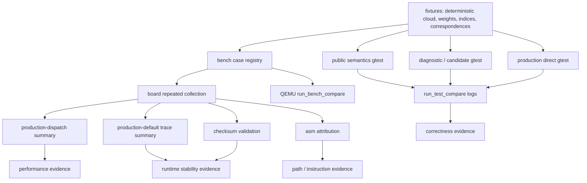

# transformation_estimation_point_to_plane_lls_weighted 测试体系总览

## 本文职责

本文说明 `transformation_estimation_point_to_plane_lls_weighted` 专项测试工程的整体结构。本文先定义测试类型，再说明运行入口、覆盖矩阵、证据文件和文档阅读路径。

专项目录：

```text
test-rvv/registration/transformation_estimation_point_to_plane_lls_weighted/
```

production 文件：

```text
registration/include/pcl/registration/impl/transformation_estimation_point_to_plane_lls_weighted.hpp
```

当前 production 结论只覆盖 full-cloud public overload、`Scalar=float`、连续 `weights_`、source xyz f32 AoS layout、target xyz+normal f32 AoS layout、规模/VLEN/byte-offset gate 均满足的路径。source-indexed、dual-indices、correspondences、`Scalar=double` 和 layout miss 路径保持标量。

## 文档阅读路径

| 读者问题                                   | 先读文档                                                                                 | 作用                                              |
| ------------------------------------------ | ---------------------------------------------------------------------------------------- | ------------------------------------------------- |
| 有哪些测试类型，入口怎么跑                 | 本文                                                                                     | 建立测试体系和证据边界。                          |
| 每个 gtest 名称是什么意思                  | `doc/correctness-tests.zh.md`                                                          | 解释 TEST 名称、输入、断言和代码位置。            |
| bench label、checksum、trace、asm 怎么来的 | `doc/benchmark-and-evidence.zh.md`                                                     | 解释 bench case-filter、日志和可提交证据。        |
| 每种 RVV 优化方式有哪些 target 和证据      | `doc/optimization-evidence.zh.md`                                                      | 按优化方式索引代码路径、target、结果和边界。      |
| `include/impl` 和 `src` 函数怎么组织   | `doc/test-support-code-map.zh.md`                                                      | 解释函数族、调用关系和 production/test 边界。     |
| 为什么采用当前 production 方案             | `doc/transformation_estimation_point_to_plane_lls_weighted-evaluation.zh.md`           | 记录候选取舍、历史数据、EvidenceDecision 和风险。 |
| 当前 production 实现如何工作               | `doc-rvv/registration/transformation_estimation_point_to_plane_lls_weighted-RVV.zh.md` | 长期 production 说明。                            |

## 测试类型定义

本 topic 同时包含 correctness、diagnostic、bench 和 evidence 产物。每类测试的证明范围不同。

| 测试类型 | 中文含义 | 本 topic 中的例子 | 证明范围 | 不能证明 |
| --- | --- | --- | --- | --- |
| 公开入口语义测试（public semantics） | 公开入口有效输入语义。 | `Std*MatchesPublicEstimator` | test-only 标量 reference 是否复刻公开入口有效输入语义。 | production RVV dispatch 是否命中。 |
| 公开入口输入语义测试（public input semantics） | 公开入口数量、权重和输入状态语义。 | `Public*MismatchKeepsOutputMatrix`、0/负权重 tests | 公开入口对数量不匹配和特殊权重的行为。 | 非法 index/correspondence 的未定义边界。 |
| 局部正确性测试（unit/correctness） | helper 或候选链路对拍。 | `FullCloudCandidateMatchesStd` | helper 或候选链路在固定输入上与标量 reference 对齐。 | 板卡性能和真实 production 入口。 |
| 数值一致性测试（numerical consistency） | 误差预算和稳定性检查。 | near-cancellation、scale-stress、非有限语义 tests | `accepted_points`、`ATA/ATb`、matrix 在误差预算内。 | bitwise 完全一致。 |
| 回退路径测试（fallback tests） | gate miss 后的标量语义。 | small input、layout gate、`Scalar=double` | gate miss 后不进入 RVV，仍使用标量语义。 | 未覆盖入口也有性能收益。 |
| 真实生产路径测试（production direct） | 真实 public full-cloud overload 命中情况。 | `ProductionFullCloud*` | public full-cloud overload 命中 production helper 或按 gate 回退。 | source-indexed、dual-indices、correspondences 的 production 接入。 |
| 生产形态诊断（production-shaped diagnostic） | 接近生产调用形态的诊断。 | `production-shaped` bench cases | test_support helper 用接近 production 的输入和 wrapper 做候选筛选。 | 真实 production dispatch。 |
| 组件消融（component ablation） | 拆分 normal-equation 组件成本。 | `component ... no-solve` bench cases | 只测 normal-equation 构造，分离公式和 reduction 成本。 | 端到端 estimate 性能。 |
| 性能测试（bench/performance） | 板卡或目标硬件耗时测试。 | board repeated summary | 目标硬件上的耗时和 speedup。 | QEMU timing 不能作为性能结论。 |
| 逐 iteration 追踪（trace） | 单 case 的迭代分布。 | `production-default-fused-abcd-ilp` trace | 多轮 iteration 分布、长尾和 checksum 序列。 | fused-vs-block B/A，当前默认 production 已无旧 pair。 |
| 校验和稳定性（checksum validation） | 日志指纹一致性。 | `checksum_validation.md` | 每轮日志含 checksum 且序列一致。 | 数学正确性完整证明。checksum 是日志指纹。 |
| 反汇编归因（asm attribution） | 指令归属确认。 | `asm_production_symbol_attribution.md` | RVV 指令是否归属于 production helper 或回退边界。 | 不同 `boundary` 的总指令数不能直接横向比较。 |
| 边界 / 对抗输入测试（negative/adversarial input） | 边界值和异常值输入。 | 非有限、near-cancellation、scale stress、size/weights mismatch、0/负权重。 | 特定边界输入下的行为。 | 未经 production API 审计的非法 index/correspondence 行为。 |

## 运行入口分类

`run_test` 和 `run_bench` 是 Make target，不等于单一测试类型。具体类型由源码和参数决定。

| 入口                                                         | 实际动作                                                | 生成文件                                                                             | 证据类型                                       | 性能结论                                               |
| ------------------------------------------------------------ | ------------------------------------------------------- | ------------------------------------------------------------------------------------ | ---------------------------------------------- | ------------------------------------------------------ |
| `make ... run_test`                                        | 编译并运行当前`TARGET_TEST`。                         | `log/qemu/run_test.log`，或被 compare 子目标覆盖为 std/RVV 文件。                  | gtest correctness。                            | 无。                                                   |
| `make ... run_test_std`                                    | 关闭`__RVV10__` 编译 gtest。                          | `log/qemu/run_test_std.log`                                                        | std correctness log。                          | 无。                                                   |
| `make ... run_test_rvv`                                    | 开启`__RVV10__` 编译 gtest。                          | `log/qemu/run_test_rvv.log`                                                        | RVV correctness log。                          | 无。                                                   |
| `make ... run_test_compare`                                | 顺序运行 std 和 RVV gtest。                             | `run_test_std.log`、`run_test_rvv.log`                                           | std/RVV correctness 对拍。                     | 无。                                                   |
| `make ... run_board_test`                                  | 部署板卡并运行当前 `REMOTE_TEST_ARGS` gtest。          | `log/board/run_test.log`                                                           | 单次板卡 gtest smoke。                         | 只能作为诊断信号。                                     |
| `make ... run_board_test_*`                                | 部署板卡并运行指定 gtest filter。                       | `log/board/run_board_test_<alias>/`                                                | 单次板卡 gtest smoke。                         | 只能作为诊断信号。                                     |
| `make ... run_bench`                                       | 运行当前 bench 二进制。                                 | stdout，或被子目标 tee 到 log。                                                      | bench case 输出。                              | 取决于运行环境。                                       |
| `make ... run_bench_compare`                               | 运行 std/RVV bench 并解析。                             | `log/qemu/run_bench_std.log`、`run_bench_rvv.log`、`analyze_bench_compare.log` | QEMU 日志形状和 checksum 检查。                | QEMU timing 无性能结论。                               |
| `make ... run_board_bench_compare`                         | 部署板卡并运行当前 `BENCH_ARGS` bench compare。        | `log/board/run_bench_std.log`、`run_bench_rvv.log`、`analyze_bench_compare.log` | 单次板卡 bench smoke。                         | 只能作为诊断信号。                                     |
| `make ... run_board_bench_*`                               | 部署板卡并运行指定 bench case-filter。                 | `log/board/run_board_bench_<alias>/`                                               | 单次板卡 bench smoke。                         | 只能作为诊断信号。                                     |
| `make ... board_smoke`                                     | 部署 board、跑 board gtest 和 bench compare、抓回日志。 | `log/board/*.log`                                                                  | 板卡 smoke 和 single-run bench。               | 只能作为诊断信号。                                     |
| `make ... collect_board_row_sources_repeated`              | 多轮采集行来源诊断。                                   | `log/board/row_sources_diagnostic/summary.md` 等                                  | 行来源重复板卡采集。                           | 只能作为诊断信号；不能证明 production dispatch。       |
| `make ... collect_board_production_dispatch_repeated`      | 多轮采集真实 public overload std/RVV speedup。          | `log/board/production_dispatch_fused_abcd_ilp/summary.md`                          | 生产路径重复板卡性能。                         | 可以支撑当前 production 性能结论。                     |
| `make ... collect_board_production_default_fused_abcd_ilp` | 多轮采集默认 RVV path trace、checksum、asm。            | `production_default_fused_abcd_ilp/*summary*.md` 等                                | 追踪、校验和、反汇编归因。                     | 可支撑默认 RVV path 稳定性；不产出旧 block/fused B/A。 |

## 细粒度 Target

每个测试类型都应有可复核的 target alias。alias 不需要新 binary，可以是同一二进制上的 gtest filter、case-filter 包装，或者板卡 smoke 包装。

下列表格中的日志路径表示运行 target 后的默认输出位置。它们不自动进入提交候选。当前提交候选只看“当前可提交证据”表。

### gtest alias

| target | 主测试类型 | 附带类型 | 主要日志 |
| --- | --- | --- | --- |
| `run_test_public_semantics` | 公开入口语义测试。 | 行来源公开语义。 | `log/qemu/run_test_public_semantics_std.log`、`run_test_public_semantics_rvv.log`。 |
| `run_test_input_semantics` | 公开入口输入语义测试。 | 边界 / 对抗输入。 | `log/qemu/run_test_input_semantics_std.log`、`run_test_input_semantics_rvv.log`。 |
| `run_test_row_sources` | 局部正确性测试。 | 行来源诊断、回退路径、边界输入。 | `log/qemu/run_test_row_sources_std.log`、`run_test_row_sources_rvv.log`。 |
| `run_test_candidates` | 局部正确性测试。 | 数值一致性、组件消融正确性、边界输入。 | `log/qemu/run_test_candidates_std.log`、`run_test_candidates_rvv.log`。 |
| `run_test_production_direct` | 真实生产路径测试。 | 回退路径、布局门控正确性、数值一致性。 | `log/qemu/run_test_production_direct_std.log`、`run_test_production_direct_rvv.log`。 |
| `run_test_compare` | 正确性汇总入口。 | 覆盖上述全部 gtest 类型。 | `log/qemu/run_test_std.log`、`log/qemu/run_test_rvv.log`。 |

### bench alias

`run_bench_default_diagnostic` 是综合诊断入口，也就是默认大汇总。它把 full-cloud staged candidate、block-reduction、fused formula 和 row-source candidate 混在同一组默认 case 中。复核数据源取舍时，优先运行 `run_bench_row_sources`。

| target | 主测试类型 | case-filter / 作用 | 主要日志 |
| --- | --- | --- | --- |
| `run_bench_default_diagnostic` | 综合诊断入口。 | 空；默认大汇总，覆盖 full-cloud、block/fused 和 row-source candidate。 | `log/qemu/run_bench_default_diagnostic_std.log`、`run_bench_default_diagnostic_rvv.log`、`analyze_bench_compare_default_diagnostic.log`。 |
| `run_bench_row_sources` | 行来源诊断。 | `row-sources`；隔离 full-cloud/source-indexed/dual-indices/correspondences candidate。 | `log/qemu/run_bench_row_sources_std.log`、`run_bench_row_sources_rvv.log`、`analyze_bench_compare_row_sources.log`。 |
| `run_bench_fused_formula` | 组件消融。 | `fused-formula`。 | `log/qemu/run_bench_fused_formula_std.log`、`run_bench_fused_formula_rvv.log`、`analyze_bench_compare_fused_formula.log`。 |
| `run_bench_production_dispatch` | 真实生产路径性能测试。 | `production-dispatch`。 | `log/qemu/run_bench_production_dispatch_std.log`、`run_bench_production_dispatch_rvv.log`、`analyze_bench_compare_production_dispatch.log`。 |
| `run_bench_production_shaped_fused_formula` | 生产形态诊断。 | `production-shaped-fused-formula`。 | `log/qemu/run_bench_production_shaped_fused_formula_std.log`、`run_bench_production_shaped_fused_formula_rvv.log`、`analyze_bench_compare_production_shaped_fused_formula.log`。 |
| `run_bench_generic_fused_abc` | 组件消融。 | `generic-fused-abc`；三类代表点型的 `abc` 候选。 | `log/qemu/run_bench_generic_fused_abc_std.log`、`run_bench_generic_fused_abc_rvv.log`、`analyze_bench_compare_generic_fused_abc.log`。 |
| `run_bench_generic_fused_formula` | 组件消融。 | `generic-fused-formula`；三类代表点型的 `abc`、D 项和 `abcd` 候选。 | `log/qemu/run_bench_generic_fused_formula_std.log`、`run_bench_generic_fused_formula_rvv.log`、`analyze_bench_compare_generic_fused_formula.log`。 |
| `run_bench_generic_fused_abc_trace` | 逐轮追踪。 | `generic-fused-abc-trace`。 | `log/qemu/run_bench_generic_fused_abc_trace_std.log`、`run_bench_generic_fused_abc_trace_rvv.log`、`analyze_bench_compare_generic_fused_abc_trace.log`。 |
| `run_bench_production_default_fused_abcd_ilp` | 默认生产路径追踪。 | `production-default-fused-abcd-ilp` 的 QEMU std/RVV 形状检查。 | `log/qemu/run_bench_production_default_fused_abcd_ilp_std.log`、`run_bench_production_default_fused_abcd_ilp_rvv.log`、`analyze_bench_compare_production_default_fused_abcd_ilp.log`。 |
| `run_bench_production_default_fused_abcd_ilp_rvv` | 默认生产路径追踪。 | `production-default-fused-abcd-ilp` 的 RVV-only 形状检查。 | `log/qemu/run_bench_production_default_fused_abcd_ilp_rvv.log`。 |

### board smoke alias

`run_board_test_*` 和 `run_board_bench_*` 是单次板卡运行入口。`run_board_test_*` 运行 RVV 构建的 gtest binary，并通过 gtest filter 选择子集。它们默认拉回日志到对应 target 名称目录。单次 smoke 只证明可在板卡执行、输出日志和 checksum，不写成 repeated performance evidence。

| target | 主测试类型 | 对应本地 target | 默认输出 |
| --- | --- | --- | --- |
| `run_board_test_public_semantics` | 公开入口语义测试。 | `run_test_public_semantics`。 | `log/board/run_board_test_public_semantics/`。 |
| `run_board_test_input_semantics` | 公开入口输入语义测试。 | `run_test_input_semantics`。 | `log/board/run_board_test_input_semantics/`。 |
| `run_board_test_row_sources` | 行来源与回退测试。 | `run_test_row_sources`。 | `log/board/run_board_test_row_sources/`。 |
| `run_board_test_candidates` | 候选正确性测试。 | `run_test_candidates`。 | `log/board/run_board_test_candidates/`。 |
| `run_board_test_production_direct` | 真实生产路径测试。 | `run_test_production_direct`。 | `log/board/run_board_test_production_direct/`。 |
| `run_board_bench_default_diagnostic` | 综合诊断入口。 | `run_bench_default_diagnostic`。 | `log/board/run_board_bench_default_diagnostic/`。 |
| `run_board_bench_row_sources` | 行来源诊断。 | `run_bench_row_sources`。 | `log/board/run_board_bench_row_sources/`。 |
| `run_board_bench_fused_formula` | 组件消融。 | `run_bench_fused_formula`。 | `log/board/run_board_bench_fused_formula/`。 |
| `run_board_bench_production_dispatch` | 真实生产路径性能测试。 | `run_bench_production_dispatch`。 | `log/board/run_board_bench_production_dispatch/`。 |
| `run_board_bench_production_shaped_fused_formula` | 生产形态诊断。 | `run_bench_production_shaped_fused_formula`。 | `log/board/run_board_bench_production_shaped_fused_formula/`。 |
| `run_board_bench_generic_fused_abc` | 组件消融。 | `run_bench_generic_fused_abc`。 | `log/board/run_board_bench_generic_fused_abc/`。 |
| `run_board_bench_generic_fused_formula` | 组件消融。 | `run_bench_generic_fused_formula`。 | `log/board/run_board_bench_generic_fused_formula/`。 |
| `run_board_bench_generic_fused_abc_trace` | 逐轮追踪。 | `run_bench_generic_fused_abc_trace`。 | `log/board/run_board_bench_generic_fused_abc_trace/`。 |
| `run_board_bench_production_default_fused_abcd_ilp` | 默认生产路径追踪。 | `run_bench_production_default_fused_abcd_ilp`。 | `log/board/run_board_bench_production_default_fused_abcd_ilp/`。 |

### board repeated evidence target

| target | 主测试类型 | 作用 | 默认输出 |
| --- | --- | --- | --- |
| `collect_board_row_sources_repeated` | 行来源重复采集。 | 多轮采集 `row-sources` case-filter，判断是否值得进入下一轮 production integration。 | `log/board/row_sources_diagnostic/summary.md`。 |
| `collect_board_production_dispatch_repeated` | 生产路径重复采集。 | 多轮采集真实 public full-cloud overload 的 std/RVV speedup。 | `log/board/production_dispatch_fused_abcd_ilp/summary.md`。 |
| `collect_board_production_default_fused_abcd_ilp` | 默认生产路径重复采集。 | 多轮采集默认 RVV path trace 和 checksum。 | `log/board/production_default_fused_abcd_ilp/`。 |
| `summarize_board_production_default_fused_abcd_ilp` | 追踪汇总。 | 从默认 RVV path raw logs 生成 trace summary。 | `log/board/production_default_fused_abcd_ilp/trace_summary.md`。 |
| `asm_production_default_fused_abcd_ilp` | 反汇编归因。 | 生成默认 production helper 的反汇编归因摘要。 | `log/board/production_default_fused_abcd_ilp/asm_production_symbol_attribution.md`。 |

## 测试流程



## 输入数据总览

测试和 bench 使用确定性合成数据。这样 std/RVV、QEMU/board、多轮采集可以复现 checksum 和矩阵结果。

| 输入来源                   | 生成函数                                              | 数据形态                                                                  | 用途                                                           |
| -------------------------- | ----------------------------------------------------- | ------------------------------------------------------------------------- | -------------------------------------------------------------- |
| 解析曲面点云               | `make_surface_cloud(grid_radius, step)`             | `(2 * grid_radius + 1)^2` 个 `PointNormal` 点；法线由解析偏导归一化。 | gtest correctness。                                            |
| bench 曲面点云             | `make_bench_cloud_with_at_least(target_size)`       | 至少生成请求规模；当前 evidence 使用 262144 点。                          | bench 和 board 证据。                                          |
| target 点云                | `make_target_cloud(source)`                         | 对 source 应用温和刚体变换，保留 normal。                                 | full-cloud、indexed、bench。                                   |
| 权重                       | `make_weights(n)`                                   | 周期序列，覆盖小于、接近和大于 1 的 normal 缩放。                         | full/source/dual public weights。                              |
| source indices             | `make_source_indices(n)`                            | 有效、乱序、重复的 source 索引。                                          | source-indexed 和 dual-indices。                               |
| target indices             | `make_target_indices(n)`                            | 有效、乱序、重复的 target 索引。                                          | dual-indices。                                                 |
| correspondences            | `make_weighted_correspondences(n)`                  | 有效、乱序、重复 correspondence，权重来自`correspondence.weight`。      | 公开入口语义测试和行来源 candidate。                           |
| bench correspondences      | `make_bench_correspondences(n)`                     | 确定性子集。                                                              | correspondences bench。                                        |
| representative point types | `copy_source_as_xyz`、`copy_target_as_xyzinormal` | `PointXYZ -> PointNormal`、`PointXYZ -> PointXYZINormal`。            | generic layout gate correctness 和 production-dispatch bench。 |

## 覆盖矩阵

| 维度                       | 已覆盖                                                                  | 证据位置                                                                                                                                 | 当前边界                                                             |
| -------------------------- | ----------------------------------------------------------------------- | ---------------------------------------------------------------------------------------------------------------------------------------- | -------------------------------------------------------------------- |
| full-cloud public overload | 已覆盖公开入口语义测试、真实生产路径测试和 bench。 | `src/test_teptplw_public_semantics.cpp`、`src/test_teptplw_production_direct.cpp`、`production_dispatch_fused_abcd_ilp/summary.md` | 只批准`Scalar=float`、连续 weights、layout gate 成立。             |
| source-indexed             | 已覆盖公开入口语义测试、test-only candidate、行来源诊断 target 和 board target。 | `src/test_teptplw_public_semantics.cpp`、`src/test_teptplw_row_sources.cpp`、`run_bench_row_sources`、`run_board_bench_row_sources`、`collect_board_row_sources_repeated` | production 保持标量。 |
| dual-indices               | 已覆盖公开入口语义测试、test-only candidate、行来源诊断 target 和 board target。 | 同上。 | production 保持标量。 |
| correspondences            | 已覆盖公开入口语义测试、test-only candidate、行来源诊断 target 和 board target。 | 同上。 | production 保持标量；非法 index 行为需谨慎。 |
| finite point/normal mask   | 已覆盖。                                                                | `InvalidLaneMaskMatchesStd`、非有限语义 tests。                                                                                        | weight 不参与 finite mask。                                          |
| non-finite weight          | 已覆盖。                                                                | `NonFiniteWeightsAreNotMaskedWhenPointsAreFinite`、production non-finite tests。                                                       | 非有限 weight 保留并传播到 normal-equation。                         |
| near-cancellation          | 已覆盖。                                                                | block-reduction 和 fused formula stress tests。                                                                                          | 检查误差预算，不要求 bitwise 一致。                                  |
| scale stress               | 已覆盖。                                                                | block-reduction 和 production scale tests。                                                                                              | 覆盖大坐标和宽权重动态范围。                                         |
| layout gate                | 已覆盖 source generic、target generic、double-normal fallback。         | 真实生产路径测试。                                                                                                                       | 未逐类型上板的 gate-allowed 点型不能声明逐类型性能。                 |
| `Scalar=double`          | 有 fallback smoke。                                                     | `ProductionFullCloudScalarDoubleFallsBackToScalar`                                                                                     | 可补更强 reference 对拍。                                            |
| mismatch public input      | 已覆盖 full/source/dual 的 target、index stream 和 weights 数量不匹配。 | `src/test_teptplw_input_semantics.cpp`                                                                                                 | 数量不匹配时 public overload 打印错误并返回，matrix 保持调用前状态。 |
| zero / negative weights    | 已覆盖。                                                                | `src/test_teptplw_input_semantics.cpp`                                                                                                 | 0/负权重是当前有效数值输入；不写成业务推荐。                         |
| empty / invalid index      | 未覆盖。                                                                | 暂无提交证据。                                                                                                                           | 先按 production API 和 solver 行为审计语义。                         |

## 当前可提交证据

下列文件已经是 tracked evidence，且被长期文档引用。

| 文件                                                                                 | 证据角色                                               |
| ------------------------------------------------------------------------------------ | ------------------------------------------------------ |
| `log/qemu/run_test_std.log`                                                        | QEMU std gtest correctness；39 passed + 1 skipped。    |
| `log/qemu/run_test_rvv.log`                                                        | QEMU RVV gtest correctness；40 passed。                |
| `log/board/production_dispatch_fused_abcd_ilp/summary.md`                          | production-dispatch repeated std/RVV speedup summary。 |
| `log/board/production_default_fused_abcd_ilp/trace_summary.md`                     | 默认 RVV path 多轮 trace summary。                     |
| `log/board/production_default_fused_abcd_ilp/checksum_validation.md`               | 默认 RVV path checksum 序列一致性。                    |
| `log/board/production_default_fused_abcd_ilp/asm_production_symbol_attribution.md` | 默认 production helper 反汇编归因。                    |

## 默认不提交的生成产物

下列文件可以在本机生成，用于当轮排查。它们默认不进入提交。

| 文件或模式                                                                            | 原因                                                                              |
| ------------------------------------------------------------------------------------- | --------------------------------------------------------------------------------- |
| `log/qemu/run_bench_std.log`、`run_bench_rvv.log`、`analyze_bench_compare.log`  | QEMU timing 不作为性能结论；当前文档只保留 correctness logs。                     |
| `log/board/run_bench_std.log`、`run_bench_rvv.log`、`analyze_bench_compare.log` | single-run board diagnostic，不属于当前 repeated summary 主证据。                   |
| `log/board/**/run*.log`                                                             | raw board logs；默认 summary-only。                                               |
| `log/board/**/board_env_*.log`                                                      | 板卡环境 raw log；默认不提交。                                                    |
| `log/board/**/collection_manifest.json`                                             | 采集 manifest 可能包含本机或远端信息；默认不提交。                                |
| `log/board/**/analyze_rvv_ba.md`、`ba_below_1_frequency.txt`                      | 只有被文档指定为当前证据时才提交；当前 production-default 无旧 block/fused pair。 |
| `log/vec_missed_log/`                                                               | compiler auto-vectorization 诊断 raw log；默认不提交。                            |

## 当前结论边界

当前 correctness 证据覆盖 public full-cloud direct、production helper normal-equation、near-cancellation、scale-stress、非有限 point/normal、非有限 weight、fallback、输入数量不匹配、0/负权重和三类代表点型。当前 performance 证据只覆盖三类代表点型在 262144 点上的 repeated board std/RVV speedup。未逐类型上板的 gate-allowed 点型只能继承 correctness 和 representative performance 判断。
